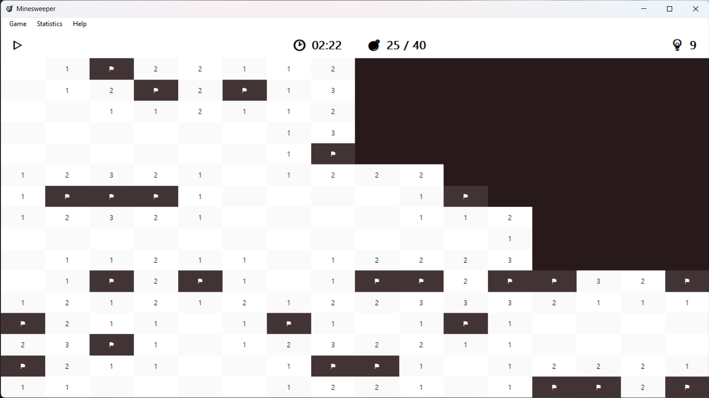
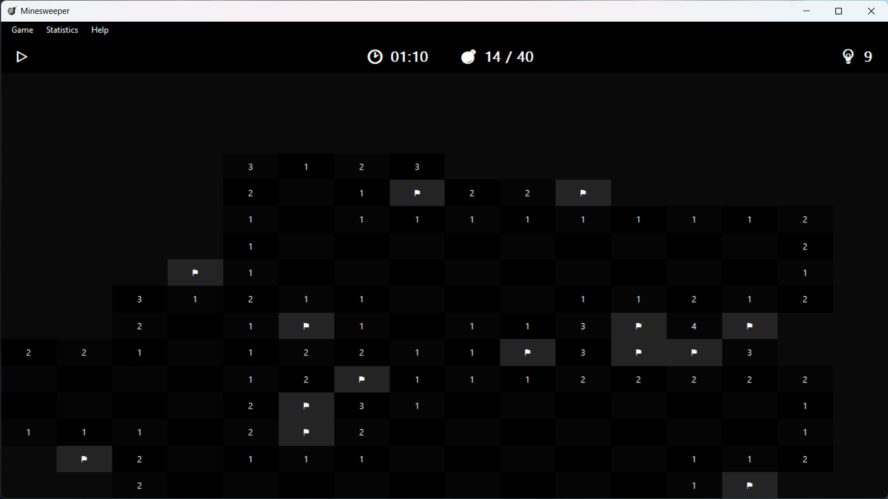
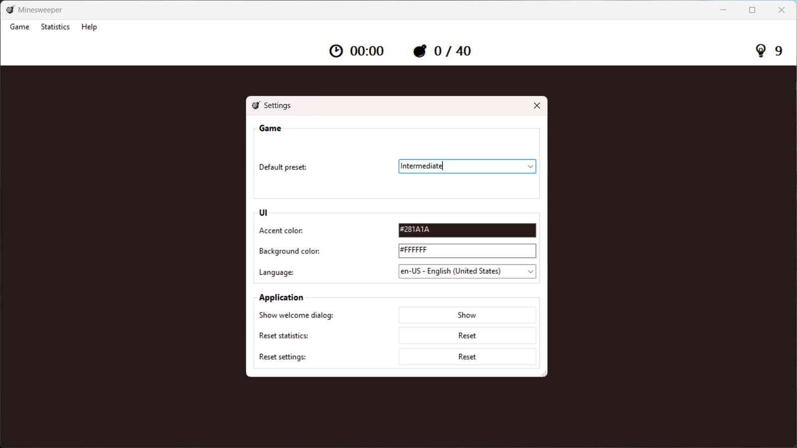
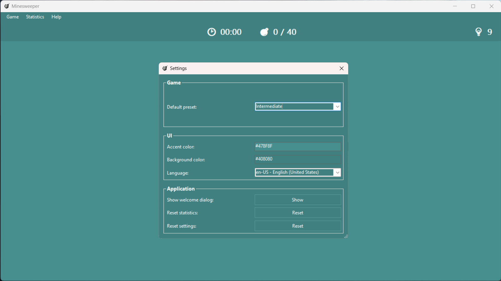
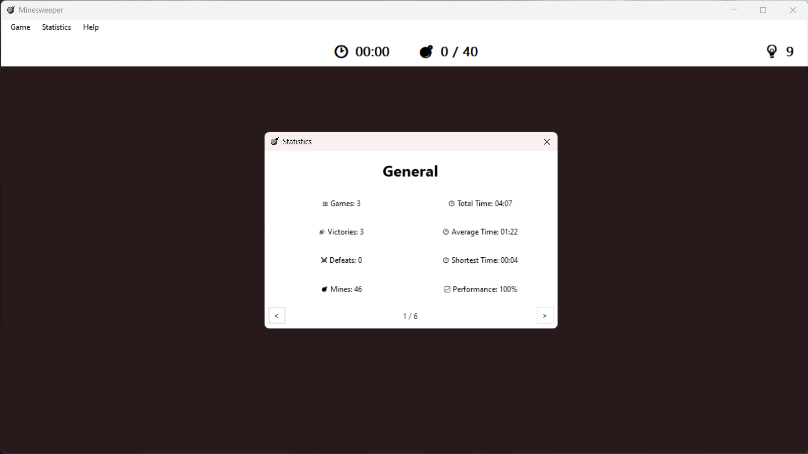
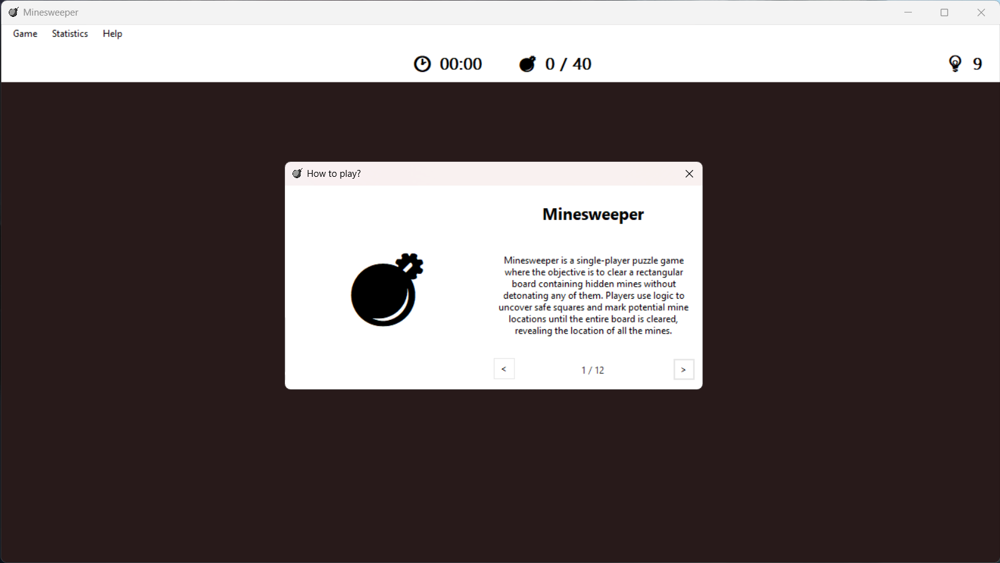

# Minesweeper
Minesweeper is a C# Windows Forms Application that recreates the classic Minesweeper game but with a new UI.

## Features
- Multiple board presets: Mini, Beginner, Intermediate, Expert, and Custom
- Hints
- Customizable theme colors (including Dark Mode)
- Multiple languages (en and de)
- Game Statistics
- Game Tutorial

## Getting started / Installation
To run Minesweeper on your computer, simply download the latest `.zip` or `.appxbundle` file from the [releases section](https://github.com/ManuelKlaer/windows-forms-minesweeper/releases/latest) of the GitHub repository, extract/install it, and run the `Minsweeper` executable.

**Requirements:**
- If you want to use the portable version of this application, you need to have the latest .NET Desktop Runtime 7 installed on your computer. [=>](#portable-net-desktop-runtime-7)
- If you want to install this application using the .appxbundle, you need to have the latest certificate installed on your computer. [=>](#appxbundle-certificate-installation)

*Note: When running the executable, you may see a Windows Defender popup that warns you that the application is from an unknown author. This is normal and expected, and you can safely run the application as long as you downloaded it from the [original source](https://github.com/ManuelKlaer/windows-forms-minesweeper). To run the application, simply click on "More info" and then "Run anyway". If you have any concerns about the safety of the application, please do not hesitate to contact the developers.*

## Requirements
### `Portable:` .NET Desktop Runtime 7
To run Minesweeper, you need to have .NET Desktop Runtime 7 installed on your computer. If you don't have it installed, you can download it from [Microsoft's website](https://dotnet.microsoft.com/en-us/download/dotnet/7.0).

Once the .NET Desktop Runtime 7 is installed on your computer, you should be able to run Minesweeper without any issues. If you have any problems running the application, please feel free to contact the developers.

#### Installing the .NET Desktop Runtime 7 using winget
Alternatively, if you have the winget package manager installed on your computer, you can install the .NET Desktop Runtime by running the following command in a command prompt or PowerShell window:
```ps
winget install Microsoft.DotNet.DesktopRuntime.7
```

### `Appxbundle:` Certificate Installation
1. Download the latest certificate (`Minesweeper.cer`) from the [releases section](https://github.com/ManuelKlaer/windows-forms-minesweeper/releases/latest).
2. Open it by double-clicking on it.
3. Click on "Install Certificate".
4. In the Certificate Import Wizard, choose "Local Machine" and click "Next".
5. If prompted with a User Account Control prompt, click "Yes".
6. Choose "Place all certificates in the following store" and click "Browse".
7. Choose "Trusted Root Certification Authorities" and click "OK".
8. Click "Next" and then "Finish".
9. You should see a message confirming that the import was successful. Click "OK".
10. Now you can install the `.appxbundle`

*Note: The reason for installing the certificate is that the package is not signed by a trusted publisher. By installing the certificate, you are essentially telling your computer that you trust the publisher of the Minesweeper game package. If you have any concerns about installing the certificate or the package, please contact the developers for further assistance.*

## Screenshots
<p align="center">
    
    
</p>
<p align="center">
    
    
</p>
<p align="center">
    
    
</p>

## Building from source
### 1. Prerequisites
- [Visual Studio 2022](https://visualstudio.microsoft.com/vs/) with the `.NET Desktop Development` Workload
- [Git for Windows](https://git-scm.com/download/win)

### 2. Clone the repository
```ps
git clone https://github.com/ManuelKlaer/windows-forms-minesweeper.git
```
This will create a local copy of the repository in the current dictionary.

### 3. Build the project
To build Minesweeper, open the `Minesweeper.sln` item in Visual Studio. Head over to Build > Publish Selection and then select `LocalBuild_Portable`, if it isn't selected already. After that, click on Publish and wait until it's done compiling.

## Contributing
Contributions to Minesweeper are welcome! If you'd like to contribute, please fork the repository and create a pull request with your changes.

## License
Minesweeper is released under the [MIT-License](https://opensource.org/licenses/MIT).

## Credits
Minesweeper was created by [@ManuelKlaer](https://github.com/ManuelKlaer) and [@MaxMitterboeck](https://github.com/MaxMitterboeck) for a school project.

## Contact
If you have any questions or suggestions, please feel free to contact the developers.
